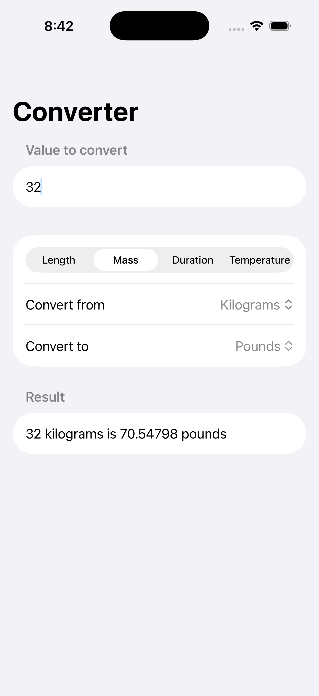

# Day 19

## 100 Days of SwiftUI

https://www.hackingwithswift.com/100/swiftui/19

Dimension type

Today was a challenge to build a unit conversion app. Initially the challenge was simply to make a length converter - so the user could convert feet to yards, or kilometers to miles. But an additional challenge on top of that was to make a more generic app that would allow the user to have options for units (distance, mass, etc.). What makes this somewhat simple is through using Apple's `Measurement` API. I got to work with some things I've never used, such as `UnitLength`, `Dimension`, `MeasurementFormatter`, and of course `Measurement`. Definitely learned a good amount in this challenge.

  

## Youtube

[How to use Xcode in SwiftUI project | Bootcamp #1](https://www.youtube.com/watch?v=N-ntKJdVNBs&list=PLwvDm4VfkdphqETTBf-DdjCoAvhai1QpO&index=2)

[Adding Text in SwiftUI | Bootcamp #2](https://www.youtube.com/watch?v=RKfkG01x79w&list=PLwvDm4VfkdphqETTBf-DdjCoAvhai1QpO&index=3)

Still fairly basic content, didn't learn too too much but a great overview. In the Adding Text in SwiftUI video, I learned about the `.baselineOffset`, `kerning`, and `.minimumScaleFactor` view modifiers. They allow you to modify the distance between lines, the distance between letters, and the scale amount if the content is too large for it's frame; respectively.