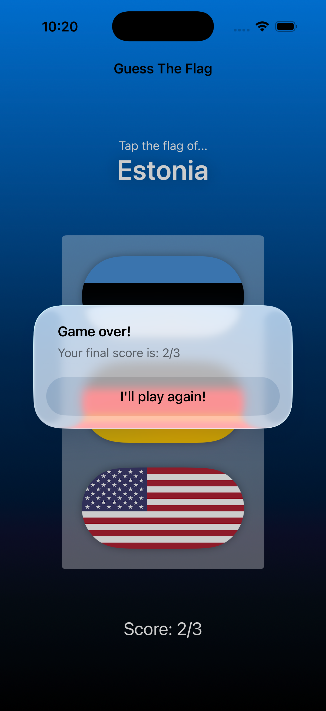

# Day 22

## 100 Days of SwiftUI

https://www.hackingwithswift.com/100/swiftui/22

Today was a simple challenge day to make some minor additions to the Guess The Flag app:

- Added a `@State` property to store the user's score
- Alert the user what flag they chose, if they chose the wrong flag
- Have the game end after 8 questions, giving the user the option to restart

Had some fun adding some more state vars, computed vars, and alerts. Nothing too fancy. It's a pretty decent lookin app though! iOS 26 looks interesting.

## Youtube

[System Icons, Multi-Color Icons, and SF Symbols in SwiftUI | Bootcamp #6](https://www.youtube.com/watch?v=Giq8jRnh0Gk&list=PLwvDm4VfkdphqETTBf-DdjCoAvhai1QpO&index=7)

Nice overview of icons and SF Symbols. I'm used to using custom icons in the professional apps that I work in, so this was a nice reminder of what's all available.

#### Notes: 
- `.font` is still used to size `Image`s... so to make an icon smaller you could use `.footnote`. I find this strange... but you can also use `.font(.system(size: 200))` to give it an explicit size. 
- `.resizable` -> makes the image... resizable 
- `.aspectRatio(contentMode: .fill)` maximizes both the width and height of the image to fit the frame; even if one spills over. `.fit` maximizes the width OR height of the image to fit the frame, not allowing either to spill over. 
- `.scaledToFit` and `.scaledToFill` do this too
- `.clipped` will clip parts of the image spilling over the frame